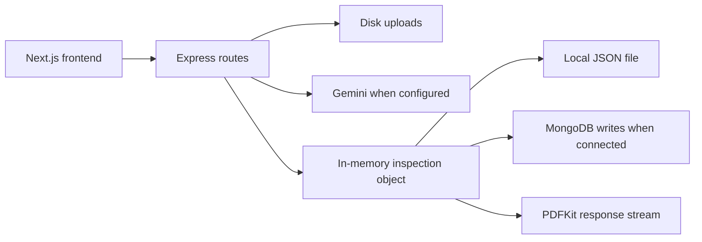

# CarsInsure backend: implementation and maintenance guide

Analyzed: 2026-09-14. Scope: the current local source, configuration, dependency manifests, and persisted-record structure. This is a static code analysis, not a claim that external services or deployment have been tested. See [frontend analysis](../frontend/FRONTEND_ANALYSIS.md) for the browser side.

## How to use this document for future changes

Start with the change-location table, then read the referenced source block. The walkthrough covers every application-source line in consecutive functional ranges, including the surrounding comments and delimiters. Related lines are explained together instead of repeating individual braces or copying the source. Line numbers refer to this snapshot; symbol names remain useful when edits move lines.

After a change, update the affected contract, walkthrough, limitations, and fingerprint entry here. Compare the fingerprints at the end against the current files to identify what needs rereading. This avoids repeating the whole analysis; it does not eliminate checking changed source. Secrets, uploaded images, generated dependencies, and individual customer records are deliberately not reproduced.

## Architecture and startup

This folder and `../frontend` are separate Git repositories. Their parent folder has no Git repository or shared package manifest. The backend is a CommonJS Express application concentrated in `src/server.js`. MongoDB is an optional write destination alongside a process-local object and JSON file; it is not currently the authoritative read path.



On import, the server loads dotenv, registers middleware, prepares upload storage, reads the JSON store, starts an asynchronous MongoDB connection, registers routes, and listens unless `VERCEL` is truthy. The Mongo connection seeds `INIT-SCAN-001` when the collection is empty. It does not hydrate the in-memory store from MongoDB or backfill local records after reconnecting.

## File inventory

| File or directory | Responsibility |
| --- | --- |
| `src/server.js` | All middleware, upload handling, schema, persistence, AI prompting, API routes, checkout simulation and PDF generation. |
| `api/index.js` | Two statements: require the server, then export the Express app for the serverless entry point. |
| `vercel.json` | Version 2 configuration; rewrite every request to `/api/index.js`. |
| `package.json` | `cars-backend` 1.0.0; `start` runs `node src/server.js`; `dev` runs `node --watch src/server.js`. No test/lint scripts. |
| `package-lock.json` | Exact npm dependency resolution; generated metadata, not application logic. |
| `.env` | Local configuration; variable names described below, values intentionally omitted. |
| `.gitignore` | Ignores `node_modules/`, `uploads/`, `.env`, and `*.log`; does not ignore `data_store.json`. |
| `data_store.json` | Object keyed by inspection ID. Eight records at review time. Contains analysis data and potentially checkout contact details; not a schema or migration file. |
| `uploads/` | Runtime original photo and contract uploads; no cleanup process exists. |
| `node_modules/`, `.git/` | Installed dependencies and repository metadata; excluded from application walkthrough. |

Declared dependencies: Express `^4.19.2`, dotenv `^16.4.5`, Multer `^1.4.5-lts.1`, Mongoose `^9.10.0`, Gemini SDK `^0.24.1`, PDFKit `^0.20.2`, cors `^2.8.5`, OpenAI `^4.52.0`. `cors` is imported but middleware is manually implemented; OpenAI is installed but not used. These are manifest declarations, not verified service/model availability.

## Configuration and local commands

Run `npm ci`, then `npm run dev`, from this folder. Use a separate terminal for the frontend. `npm start` runs without watch mode. Startup can create directories, seed MongoDB, and load existing records, so it is not a read-only verification command.

| Variable | Source behavior |
| --- | --- |
| `PORT` | Defaults to `5000`; also embedded in upload response URLs. |
| `GEMINI_API_KEY` | Live branch enabled when nonempty and not the literal `your_gemini_api_key_here`. Missing/placeholder key produces synthetic findings. |
| `MONGODB_URI` | Defaults to `mongodb://127.0.0.1:27017/carsinsure`. |
| `VERCEL` | Any truthy string chooses OS temporary storage and suppresses `app.listen`. |
| `ICREDIT_API_KEY` | Present as a local configuration name but unused by the source; no payment integration is implemented. |

The server uses global `fetch` for remote images. There is no Node `engines` constraint in the package manifest. Resolve supported runtime requirements from installed dependencies when changing runtime/deployment.

## Complete source walkthrough: `src/server.js`

| Lines | Behavior and maintenance implications |
| --- | --- |
| 1–12 | Import Express/cors/dotenv/path/fs/Multer, load environment, instantiate app and port. |
| 13–25 | Set wildcard CORS origin, advertised verbs/headers and credentials; respond to OPTIONS immediately. Credentialed browser requests cannot use wildcard origin. Advertised verbs do not create corresponding routes. |
| 26–32 | Parse JSON up to `50mb`; root GET returns static success text mentioning Vercel even locally. |
| 33–43 | Select local uploads directory or OS temp directory, try to create it, mount it publicly at `/uploads`. Directory creation failures are swallowed. On Vercel the entire selected temp directory is the static root. |
| 44–49 | Multer disk storage writes timestamp plus original filename; no configured file type/size restriction. |
| 50–58 | POST upload accepts field `photo`, rejects absent file with 400, returns filename and a localhost URL. Does not derive public host/protocol from deployment. |
| 59–79 | Import Mongoose, choose connection URI, define schema and `Inspection` model. Schema details below. |
| 80–94 | Choose JSON file path; load the full object synchronously. Missing or invalid JSON becomes an empty object. |
| 95–103 | `saveLocalDb` rewrites the entire JSON object synchronously; errors are silently ignored. |
| 104–124 | Connect asynchronously; count Mongo documents and seed an initializer when empty. Log failures without preventing startup. |
| 125–141 | `inspectionStore.get/has` only read memory. `set` writes memory/file first, then upserts Mongo when readyState is 1; Mongo failures only log. |
| 142–177 | Begin `SYSTEM_PROMPT`: visible damage rules, damage taxonomy, no hidden-damage guesses, no repair cost or liability conclusions, bounding-box convention. |
| 178–199 | Prompt identifies all fourteen photo angles and allowed severity values. |
| 200–245 | Prompt specifies six analysis steps and example output JSON including quality, evidence, findings, undamaged parts and uncertainty. This is prompt text, not a runtime validator. |
| 246–250 | GET `/api/health` returns static API liveness; it does not test MongoDB, AI, or payments. |
| 251–263 | Contract upload uses Multer field `contract` and returns fixed Avis/Hyundai sample values; no OCR. |
| 264–276 | Start analyze try/catch; read `vehicleData` and `photos`, generate timestamp ID, inspect Gemini key, create SDK client if configured. |
| 277–314 | Append angle/part rules, false-positive exclusions and non-vehicle rejection instructions. Second example schema is smaller than the main prompt schema, so output fields can vary. Vehicle details are not interpolated into the model prompt. |
| 315–331 | `ANGLE_DESCRIPTIONS` labels input images for the AI request. |
| 332–348 | `ANGLE_TO_PART_MAP` supplies replacement part names for later corrections. |
| 349–379 | Iterate photos; accept URL strings or objects containing `url`, normalize digits into angle ID. Parse image data URLs or fetch HTTP-prefixed URLs and base64 encode responses. Fetch failures are logged and skipped. No HTTP status, private-host, content-size, timeout, or actual image-content validation. |
| 380–409 | Build prompt/image contents; sequentially try configured model names, log responses, remove Markdown fences, JSON.parse, stop at first successful parse. Errors including parse errors trigger the next model. `lastErr` is assigned but not returned. |
| 410–429 | If every model fails, classify any URL containing `unsplash` as demo. Other input produces a fabricated clean result with 0.98 confidence. This is not evidence of a clean vehicle. |
| 430–476 | Demo failure branch creates findings per populated image slot from a hardcoded angle catalog, fixed boxes/descriptions and calculated confidence. |
| 477–495 | Finish fallback and define `ALLOWED_PARTS_PER_ANGLE` substring rules for postprocessing. |
| 496–514 | Normalize first supporting image and rewrite mismatching part names. Always turn IMAGE_02 into windshield/glass damage, even if the original finding was hood damage. Wheel-slot correction can rewrite damage type. |
| 515–521 | If parsed `vehicle_visible` is exactly false, return 400 with model rejection reason. Missing visibility is not rejected. |
| 522–574 | Missing-key branch creates three fixed findings and randomized confidence. Counts all photo object keys, including null slots; D002 labels rear-left wheel while supporting IMAGE_11 (front-left). This branch bypasses the preceding correction/rejection logic. |
| 575–592 | Force ID and unpaid status, save result, return summary, first three findings AND full result. Catch analysis errors as JSON 500. Successful live output does not explicitly receive `vehicle_info = vehicleData`. |
| 593–599 | Checkout requires an ID found in memory, otherwise JSON 404. |
| 600–615 | Mark paid without a gateway call, save contact information, trust requested amount or use 3.00, create random pseudo-hash/transaction ID, persist and return relative PDF URL. |
| 616–640 | PDF endpoint reads memory, supplies defaults even for missing records, creates A4 PDF and sets inline download headers. No paid/ownership/existence check. `vehicleInfo` is read but unused. |
| 641–651 | Define colors and draw header containing report ID and generation date. |
| 652–669 | Draw contact information and unconditional `UNLOCKED & PAID` text. |
| 670–675 | Draw findings count with hardcoded 96% confidence and fourteen-photo statement. |
| 676–688 | Draw table column headings and initialize row position. |
| 689–712 | Draw each finding, severity color, confidence and first bounding box (or fabricated default); fixed row heights, no explicit table pagination. |
| 713–722 | Draw purported cryptographic stamp and end PDF stream. Stamp is not computed from report bytes. |
| 723–729 | Listen locally only outside Vercel, then export the app. |

## API contract

All JSON routes use the paths below directly; there is no additional router prefix. Upload routes use multipart; analyze/checkout use JSON.

| Method/path | Request | Success | Failure/current caveat |
| --- | --- | --- | --- |
| GET `/` | None | `{success:true,message}` | Static liveness. |
| GET `/api/health` | None | `{status:"ok",service}` | Static liveness. |
| POST `/api/upload` | Multipart `photo` | `{success:true,url,filename}` | 400 absent file; upload middleware errors have no custom JSON handler. |
| POST `/api/ocr/contract` | Multipart `contract` | `{success:true,data:{company,makeModel,plateNumber,agreementRef}}` | Fixed data, even if file absent. |
| POST `/api/inspection/analyze` | `{vehicleData,photos}` | `{success:true,inspectionId,summary,previewFindings,fullResults}` | 400 explicit model non-vehicle rejection; 500 caught errors. No server-side fourteen-photo requirement. |
| POST `/api/payment/checkout` | `{inspectionId,name,email,amount}` | `{success:true,message,transactionId,sha256Hash,pdfDownloadUrl}` | 404 unknown in-memory ID; no payment verification. |
| GET `/api/reports/:id/pdf` | Path ID | PDF stream | Generates a default report even for unknown/unpaid IDs. |
| GET `/uploads/:filename` | Stored filename | Static file | Publicly accessible; static middleware handles absent files. |

Example request shape (placeholder content only):

```json
{
  "vehicleData": {"company":"Example Rental","makeModel":"Example Car","plateNumber":"EXAMPLE","inspectionType":"pickup"},
  "photos": {"01":{"url":"data:image/jpeg;base64,<image-bytes>","filename":"IMAGE_01"},"02":null}
}
```

## Data contract and persistence differences

| Field | Meaning and behavior |
| --- | --- |
| `inspection_id` | Required unique string in Mongo; generated with `INS-` plus timestamp. |
| `vehicle_info`, `user_info`, `inspection_summary` | Generic Mongo Object fields; no nested validation. `vehicle_info` is not assigned on the successful live branch. |
| `findings` | Generic array: `finding_id`, `vehicle_part`, `damage_type`, `severity`, `confidence`, `supporting_images`, `bounding_boxes`, `description`, `is_duplicate`. Shape depends on AI/fallback and is not validated. |
| `bounding_boxes` | Array of `{image_id,box:[ymin,xmin,ymax,xmax]}` with intended values 0–1000; not checked/clamped. |
| `undamaged_visible_parts` | Generic array. |
| `overall_assessment` | String. |
| `is_paid` | Mongo Boolean default false; forcibly false after analysis; true after simulated checkout. |
| `sha256_hash` | String containing random/time-derived text, not a SHA-256 digest. |
| `created_at` | Mongo Date default; not explicitly added to in-memory/local result objects. |
| `image_quality`, `uncertain_findings` | Present in prompt/fallback/local records but absent from declared Mongo schema; representations can diverge. |

Photos themselves are not stored in the inspection result. Uploaded originals remain separate files without a persisted record-to-photo index. Serverless temporary storage and process memory are instance-local and ephemeral. Because report and checkout reads never query MongoDB, a record existing only in MongoDB cannot currently be retrieved there. Full-file synchronous writes lack concurrency coordination/atomic replacement, and local-save success is not communicated to clients.

## AI behavior to preserve or deliberately change

Configured retry order in this snapshot: `gemini-3.6-flash`, `gemini-3.5-flash`, `gemini-flash-latest`, `gemini-3.7-flash`, `gemini-3.5-flash-lite`. These are source strings only; availability was not verified. There is no backoff or per-request timeout in this code.

The frontend demo uses an embedded PNG, not an Unsplash URL, so it does not trigger the backend's `unsplash` fallback detector. Missing-key and exhausted-model behavior differ sharply: the former reports three predetermined damages, while the latter normally reports no damage. A valid JSON response is not necessarily valid inspection data. Treat these as explicit implementation gaps when replacing demo behavior.

## Where to make common changes

| Requested change | Backend location | Coupled frontend work |
| --- | --- | --- |
| API base URL/deployment | Upload URL at 55, `api/index.js`, `vercel.json`, storage at 36/81 | `NEXT_PUBLIC_API_URL`; four call sites. |
| Require fourteen photos | Analyze entry 265 and photo preparation 349 | Root analyze validation and checklist progress. |
| AI provider/model/prompt | 143–245 and 274–521 | Result schema/labels/error messages. |
| Change photo angles or names | Prompt, descriptions, part maps, allowed parts, both fallback catalogs | Checklist, root slots, both report helpers and SVG mapping. |
| Reliable Mongo persistence | Schema 65 and store 80–141; checkout/PDF lookups | Add reload/history API consumption if needed. |
| Real payments / new price | Checkout 594–614; server-side report authorization | Paywall handler, results CTA, unlocked banner, admin display. |
| Real OCR | 252–262 | Add intake UI; currently no caller. |
| PDF layout/content | 617–721 | Download behavior and display claims. |
| Admin data/auth | Add protected endpoints; none exist | `/admin` currently static and public. |
| Authentic report digest | Checkout 603 and PDF stamp 632/714 onward | Remove hardcoded hash and consume verified report metadata. |

## Known gaps that affect future work

There is no authentication, authorization, real payment processing, email delivery, real OCR, report verification endpoint, or admin API. Full results are already returned before checkout. The frontend unlocks even after checkout errors. Fixing the payment form alone cannot enforce a paid report.

Remote image URLs are fetched without destination restrictions, creating a server-side request forgery surface. Uploads lack file validation and limits, are publicly served, and have no retention policy. API input and AI output lack schemas; CORS is broad; errors/raw AI responses are logged or returned. These are observed code properties, not a separate penetration test.

## Verification and maintenance checklist

This documentation was checked against local source and repository status. No server startup, AI request, payment action, database mutation, deployment or application test was performed for this documentation task. No automated test suite is declared.

For future implementation changes, verify the relevant path: no-photo and fourteen-photo requests, non-vehicle and model-failure responses, valid/malformed image data, unavailable Mongo/restart behavior, checkout failure and repeated checkout, unknown/unpaid PDF ID, and reports with zero/many findings. A static syntax check is `node --check src/server.js`; it does not verify these flows.

Keep source facts separate from intended future behavior. Update this guide in the same change as implementation, and update the frontend guide when shared IDs, endpoints, payloads, prices or status semantics change.

## Snapshot fingerprints

SHA-256 of raw file bytes at analysis time (including line endings). These are documentation freshness checks, unrelated to the application report signature. Environment files and mutable customer/upload data are excluded. Run `Get-FileHash -Algorithm SHA256 <path>` from this folder to compare a file; a mismatch calls for reviewing that file and updating its affected documentation.

| File | SHA-256 |
| --- | --- |
| `src/server.js` | `4bc27b19649d66f7e26785ed54a4f8e71ea349a5cbb52115541b5dc28801026b` |
| `api/index.js` | `c2e453cff45c02b9abdb29581b169cf8e04e95c9933893f78a13224e3181bc01` |
| `package.json` | `4f4bedb297e741241b6764dae6548a621d8338361305c7c193392ff99ad30b72` |
| `package-lock.json` | `6c4c79f1df2296504fb0c425bcffd33d264748407f0389d21b6d91318edaed9e` |
| `vercel.json` | `30c9905339242939736eb547af79c946321301e0a59d5342e3b4c0f656ed07cc` |
| `.gitignore` | `0ec972a76061e0b5d6ef599d3cc0e30c9f13cb14eb2837751e29749d82d9e7b0` |
